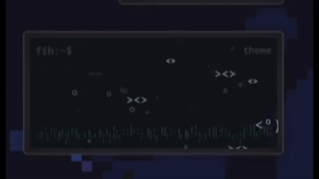
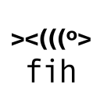

# fih 

a small fish tank that sits on your desktop  
and does absolutely nothing important.

KDE Plasma 6 widget.

<p align="center">
  
</p>

---

## install

clone the repo:
```bash
git clone https://github.com/mossware/fih.git
```

copy the widget into plasma’s local directory:
```bash
mkdir -p ~/.local/share/plasma/plasmoids
cp -r fih/com.mossware.fih ~/.local/share/plasma/plasmoids/
```

restart plasma:
```bash
kquitapp6 plasmashell
plasmashell &
```

then:
right click desktop → Add Widgets → fih

<p align="center">
  
</p>
